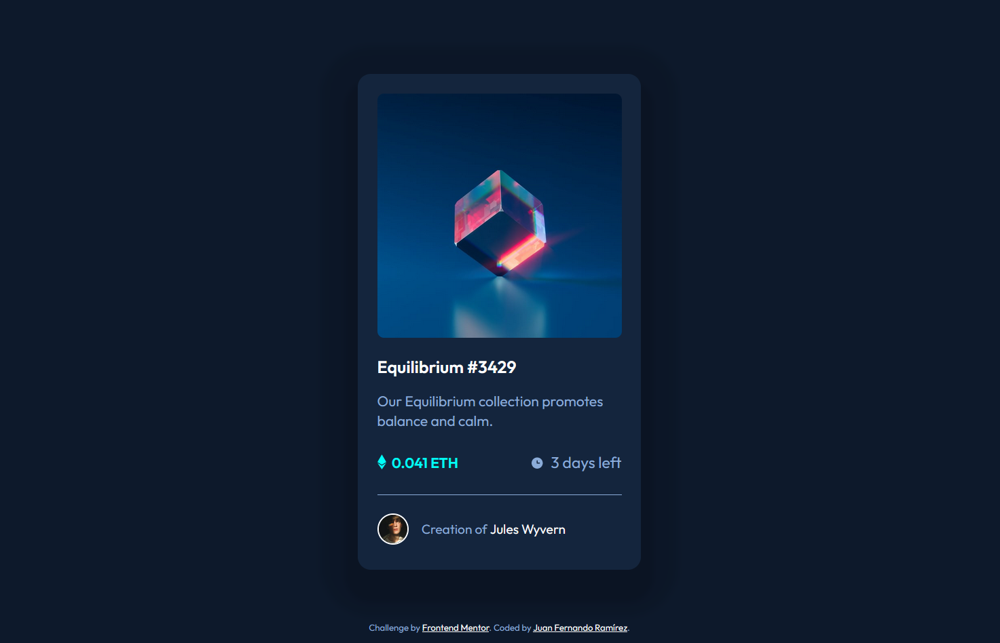

# Frontend Mentor - NFT preview card component solution

This is a solution to the [NFT preview card component challenge on Frontend Mentor](https://www.frontendmentor.io/challenges/nft-preview-card-component-SbdUL_w0U). Frontend Mentor challenges help you improve your coding skills by building realistic projects. 

## Table of contents

- [Overview](#overview)
  - [The challenge](#the-challenge)
  - [Screenshot](#screenshot)
  - [Links](#links)
- [My process](#my-process)
  - [Built with](#built-with)
  - [What I learned](#what-i-learned)
- [Author](#author)

## Overview

### The challenge

Users should be able to:

- See hover states for interactive elements

### Screenshot



### Links

- Solution URL: [https://github.com/epjuan21/FrontendMentor-NFT-preview-card-component-solution](https://github.com/epjuan21/FrontendMentor-NFT-preview-card-component-solution)
- Live Site URL: [https://epjuan21.github.io/FrontendMentor-NFT-preview-card-component-solution/](https://epjuan21.github.io/FrontendMentor-NFT-preview-card-component-solution/)

## My process

### Built with

- Semantic HTML5 markup
- CSS custom properties
- Flexbox

### What I learned

It was difficult to place the cyan color layer in front of the image when hovering over it with the mouse

I put a layer at the same level of the image

```html
	<div class="img-container">
			<div class="overlay"></div>
			
			
		</div>
```

This layer was created with cyan color and 0 opacity

```css
.overlay {
    position: absolute;
    border-radius: 8px;
    top: 0;
    bottom: 0;
    left: 0;
    right: 0;
    height: 100%;
    width: 100%;
    opacity: 0;
    transition: .5s ease;
    background-color: var(--cyan);
}
```
Then on hover the opacity is set to 0.5 to make it transparent

```css
.img-container:hover .overlay {
  opacity: 0.5;
  cursor: pointer;
}
```
## Author

- Frontend Mentor - [@epjuan21](https://www.frontendmentor.io/profile/epjuan21)
- Twitter - [@epjuan](https://twitter.com/epjuan)